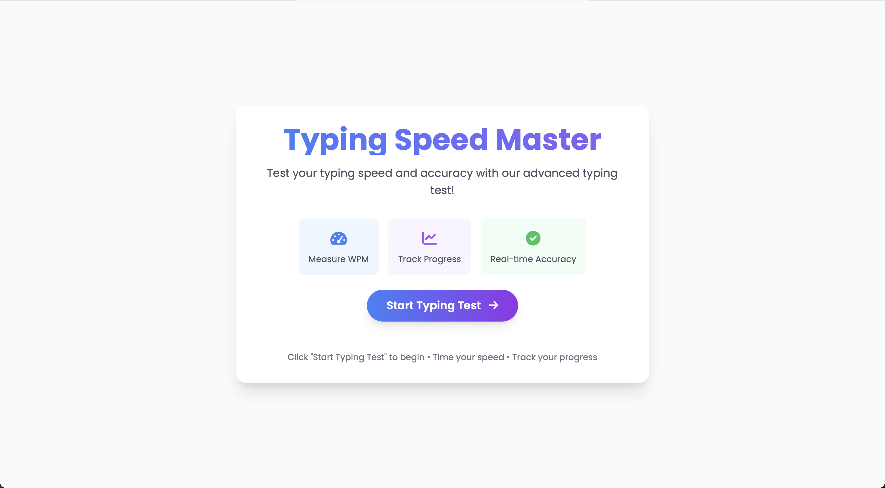
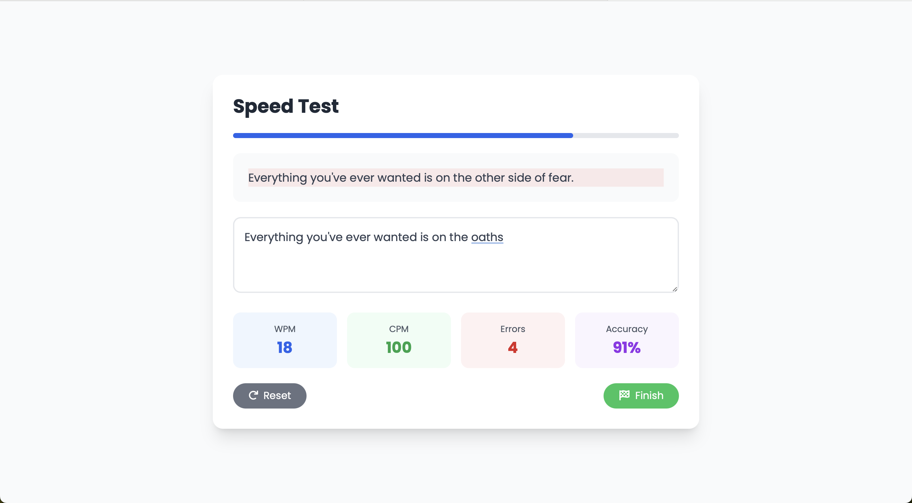
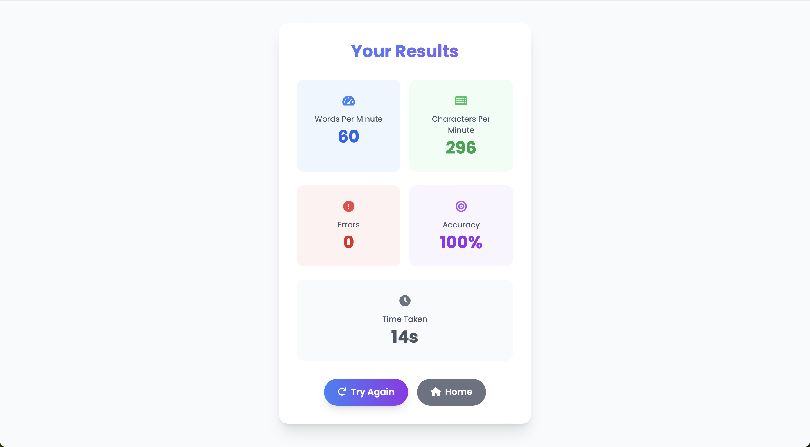

# Typing Speed Master

Typing Speed Master is a web-based application designed to help users test and improve their typing speed and accuracy. The application provides a real-time typing test, tracks progress, and displays detailed results.

## Features

- **Typing Speed Test**: Measure your Words Per Minute (WPM) and Characters Per Minute (CPM).
- **Real-Time Feedback**: Track your progress with a live progress bar and accuracy percentage.
- **Error Tracking**: Identify typing errors in real-time.
- **Countdown Timer**: A 3-second countdown before the test begins.
- **Detailed Results**: View your WPM, CPM, errors, accuracy, and time taken after completing the test.
- **Responsive Design**: Fully responsive and optimized for all devices.

## Screenshots

### Home Page
The landing page introduces the application and allows users to start the typing test.


### Typing Test
The test page includes a random sentence, a progress bar, and real-time statistics.


### Results Page
The results page displays detailed statistics about the user's performance.


## Technologies Used

- **HTML5**: Structure of the application.
- **CSS3**: Styling with TailwindCSS for a modern and responsive design.
- **JavaScript**: Core functionality, including real-time updates and result calculations.
- **Font Awesome**: Icons for a visually appealing interface.

## How to Use

1. Open the `index.html` file in your browser to access the home page.
2. Click the "Start Typing Test" button to begin.
3. On the test page:
   - Wait for the 3-second countdown.
   - Start typing the displayed sentence in the input box.
   - Monitor your progress with the live statistics and progress bar.
4. Once you finish typing the sentence, the results page will display your performance metrics.
5. Use the "Try Again" button to retake the test or the "Home" button to return to the main page.

## File Structure
```
Typing_Master/
├── index.html # Home page 
├── test.html # Typing test page 
├── result.html # Results page 
├── js/ 
│    └── script.js # Core JavaScript functionality
└── README.md # Project documentation
```


## Local Setup

1. Clone the repository:
   ```bash
   git clone <repository-url>
2. Navigate to the project directory:
    ```bash
    cd Typing_Master
3. Open index.html in your browser to start the application.

## Future Enhancements
- Add a leaderboard to compare results with other users.
- Include customizable test durations and difficulty levels.
- Provide a history of past results for tracking progress over time.

## Acknowledgments
- TailwindCSS: For the responsive and modern design framework.
- Font Awesome: For the beautiful icons.
- Google Fonts: For the Poppins font used in the application.
